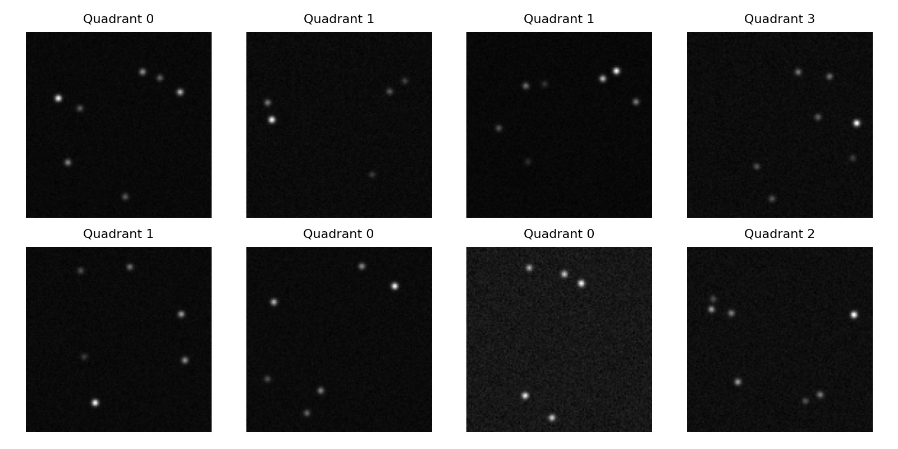
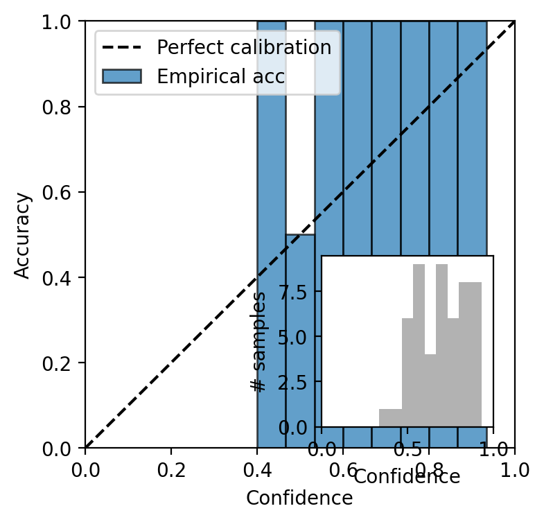
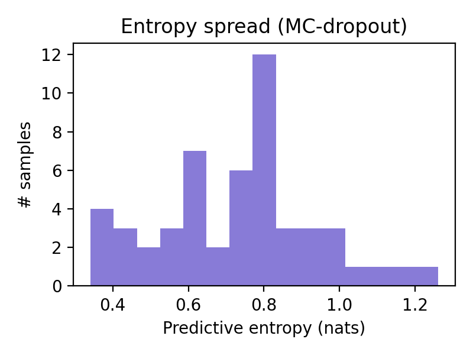

# Bayesian Calibration Demo

## Overview

The aim is to show, in a very small and clear setting, how ideas from Bayesian reasoning appear in a transformer model. I made tiny star images with most stars hidden, trained a small transformer to guess which image quadrant holds the remaining stars, and checked whether the model's stated confidence matches how often it is actually correct. I also estimated model uncertainty by running the same input through the model many times with small random drops turned on.

## Bayesian References That Guided Me

- **Astrometry.net** (Lang et al. 2009): showed how a solver accepts a sky pose only when the evidence is strong, which shaped how I think about "accept or reject" decisions.
- **Celeste** (Regier et al. 2015): treated each pixel as a random variable, so I rendered soft, noisy star blobs instead of binary dots.
- **Dropout as a Bayesian Approximation** (Gal & Ghahramani 2016): motivated the use of dropout at test time to get an uncertainty estimate.
- **Calibration of Pre-trained Transformers** (Desai & Durrett 2020): explained reliability diagrams and simple probability calibration.

## Repository Structure

- `src/astro_demo/` - Core Python modules for synthetic data, baseline solver integration, and calibration utilities.
- `notebooks/astro_calibration_demo.ipynb` - End-to-end workflow that reproduces the experiment and figures.
- `docs/` - Supporting references cited in the overview for deeper background.
- `artifacts/` - Generated figures (sample tiles, reliability diagram, entropy histogram) referenced in the write-up.
- `report.tex` & `report.pdf` - LaTeX source and compiled report mirrored in this README.
- `email_to_steven.txt` - Draft notes for the concise status update to Steven.

## Experiment Setup

I generated 256 synthetic tiles, each with 12–24 simulated stars, then masked most of them so only three to seven bright stars remained. The label is the quadrant that contains the centroid of the visible stars, so this is a simple four-class task. The split is 205 training and 51 validation examples.

The model is a two-layer transformer encoder with 64 hidden units and dropout 0.1, trained for 30 epochs with AdamW. Validation accuracy stabilizes near 92% with loss about 0.40, which is high enough to study calibration.

### Reliability Diagram

I group predictions by their stated confidence (e.g., all predictions near 0.8). For each group I measure the fraction that are correct. If confidence matches reality, the bars would lie on the diagonal line. Bars above the line mean the model is under confident (it is correct more often than it claims). Bars below the line mean over-confidence. In the diagram below most predictions sit between 0.7 and 1.0 confidence, and their accuracy is even higher, so the model is under confident.

### Calibration

On average the stated confidence differs from the true accuracy by 24 percentage points, and in the worst confidence group the gap is about 59%. The Brier score is about 0.21 (lower number is better). These values match the visual story of a conservative model that reports lower confidence than its actual hit rate.

### MC Dropout

During training, the model randomly disables a subset of its neurons (dropout). To estimate uncertainty I keep this randomness turned on at test time and run the same input many times. Then I average the probabilities and measure their spread with entropy. Higher entropy means more uncertainty. With 50 runs, the predictive entropy clusters around 0.7 nats. Incorrect predictions have higher entropy (about 0.84 on average) than correct ones (about 0.69).

## Summary

On this small task the transformer's probabilities behave sensibly but are not full Bayesian posteriors. They track reality: higher confidence usually means higher accuracy. They are conservative: in the high confidence range the model is correct more often than it claims. The simple Bayesian-style check (multiple runs with dropout) assigns higher uncertainty to mistakes than to correct predictions. As proposed by *Calibration of Pre-trained Transformers*, temperature scaling would be the next step to make the probabilities line up more closely with observed accuracy. For a stronger baseline rooted in explicit Bayes decisions, I would compare to a plate solver that reports an actual odds test.
